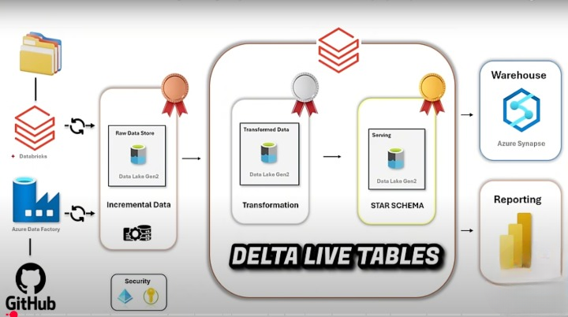
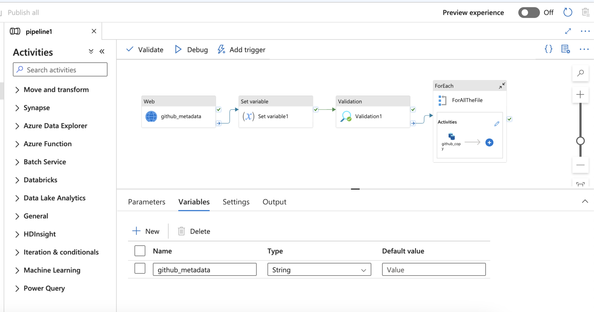
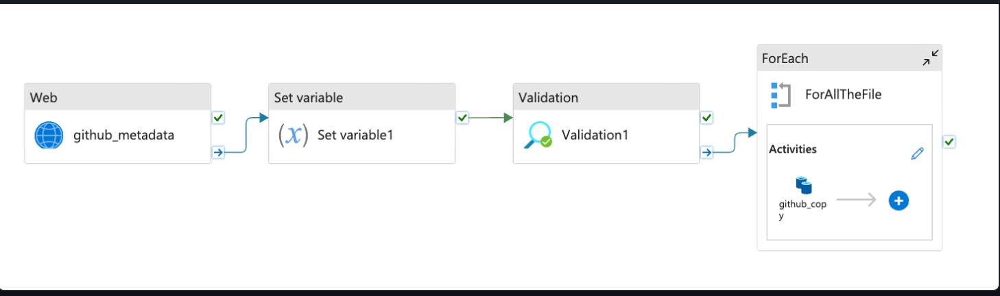
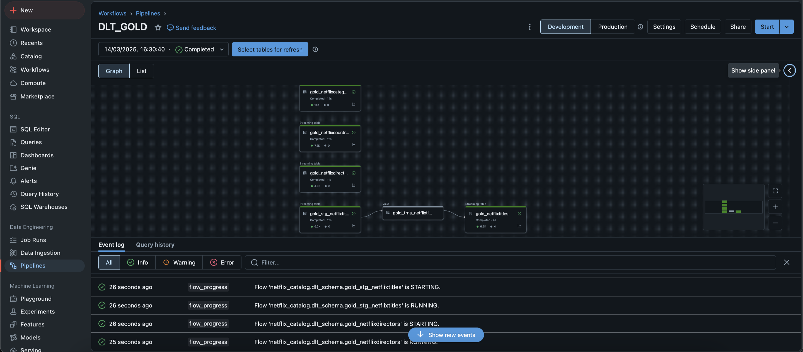
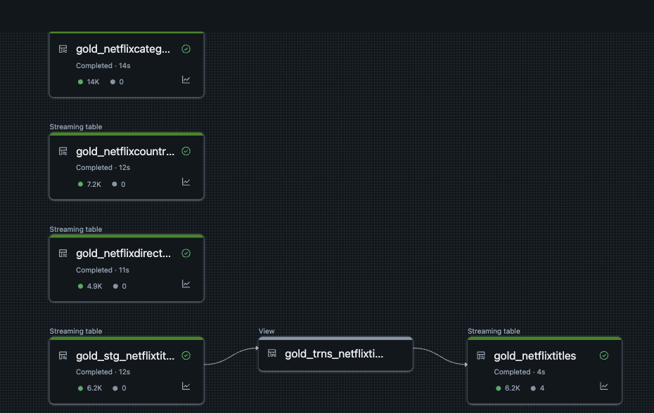

# Netflix-Azure-End-To-End-Data-Engineering-Powerhouse

## Project Overview  
This project implements a data pipeline using Azure Data Factory (ADF) and Databricks for seamless data ingestion, transformation, and processing. It follows a multi-layered storage architecture, progressing through Raw, Bronze, Silver, and Gold layers to ensure data quality and usability.

### Architecture Diagram

## Let's Get Building: Step-by-Step

### Azure Data Factory (ADF) - Your Data Orchestrator
1. **Resource Group - Your Project's Home Base**:
   - Head to the Azure Portal and create a new resource group. Consider it your project's personal workspace.

2. **Data Lake Storage (ADLS) - Your Data Reservoir**:
   - Within your resource group, spin up an ADLS account. Don't forget to enable the Hierarchical Namespace; it's crucial for organized data storage.

3. **Storage Containers - Your Data's Neighborhoods**:
   - Create `raw`, `bronze`, `silver`, and `gold` containers. Think of these as neighborhoods for your data, each with a specific purpose.

4. **ADF Instance - The Conductor**:
   - Set up an ADF instance. This is where the magic happens, orchestrating your data flow.

5. **Linked Services - Your Data Connectors**:
   - **HTTP Linked Service**: Connect to your external data source. Treat it like a bridge to your raw data.
   - **Data Lake Linked Service**: Link ADF to your ADLS account. This is the pipeline to your data reservoir.

6. **ADF Pipeline - The Data Journey**:
   - **Copy Activity**: Define the source (HTTP) and sink (ADLS). Use dynamic parameters to handle various file names and locations. This is where data moves from point A to B.

7. **Iteration & Validation - Keeping Things in Check**:
   - **ForEach Activity**: Automate processing for multiple files/folders. Think of it as a loop for your data.
   - **Validation & Metadata**: Add validation, fetch metadata, and set variables. This is like adding checks and balances to your data pipeline.

### ADF Pipeline - Visualizing the Flow

### Databricks - Your Data Transformation Hub
1. **Databricks Account - Your Analysis Playground**:
   - Get a trial or premium Databricks account. This is where you'll transform your data into insights.

2. **Admin Console & Metastore - Setting the Stage**:
   - Authenticate and set up your Metastore. Remember, one Metastore per region!

3. **Access Connector - Bridging Databricks & ADLS**:
   - Connect Databricks to ADLS with an Access Connector. Assign the right IAM roles; it's like giving Databricks the keys to your data.

4. **Workspace, Catalog, Schema - Organizing Your Insights**:
   - Connect to your workspace and set up your catalog, schema, and external storage. This is where you organize your transformed data.

### Databricks Workflows - Automating Your Transformations
1. **Autoloader Notebook - Streamlining Ingestion**:
   - Use Autoloader to automatically ingest raw data into the Bronze layer. It's like having an automatic data feeder.

2. **Silver Layer Transformation - Refining Your Data**:
   - Create notebooks for Silver layer transformations. Use dynamic lookups for flexible processing.

3. **Workflow Setup - Automating Your Pipeline**:
   - Use iterative tasks and lookups to automate your workflows. Add conditions for smart execution.

4. **Delta Live Tables (DLT) - Your Gold Standard**:
   - Use Job Clusters for production. Leverage DLT for defining Gold layer processing with rules and conditions.

### Delta Live Tables - Visualizing the Gold Layer

## Pro Tips & Beyond
- **Autoloader Schema Evolution**: Dive into schema evolution to handle changes like a pro.
- **IAM Permissions**: Double-check your IAM roles. It's the gatekeeper to your data.
- **Optimization**: Think big! Optimize for large-scale data and cost efficiency.
- **Error Handling & Logging**: Implement robust error handling and logging. It's your data's safety net.
- **Data Quality Checks**: Ensure data integrity at every stage.
- **Version Control**: Use Git for versioning your notebooks and ADF pipelines.

## Conclusion
This project builds a robust end-to-end data pipeline using Azure Data Factory and Databricks for seamless data ingestion, processing, and transformation. It leverages dynamic parameterization, automated workflows, and Delta Live Tables to optimize data processing across multiple storage layers!